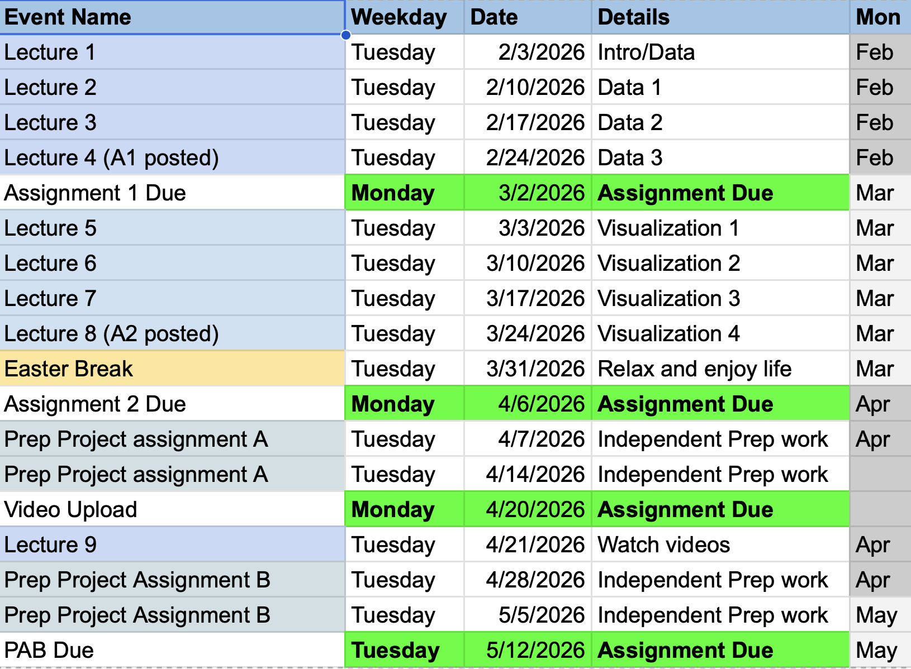

# 02806 - Social Data Analysis and Visualization

## Course Overview

  

## Description

This repository contains materials and projects for the Social Data Analysis and Visualization course (02806). The course covers data analysis techniques, visualization methods, and tools for understanding and presenting social data insights.

## Contents

- Data analysis projects
- Visualization examples and code
- Practice exercises and assignments

## Technologies

- Python
- Jupyter (VsCode Extension)

## License

MIT
